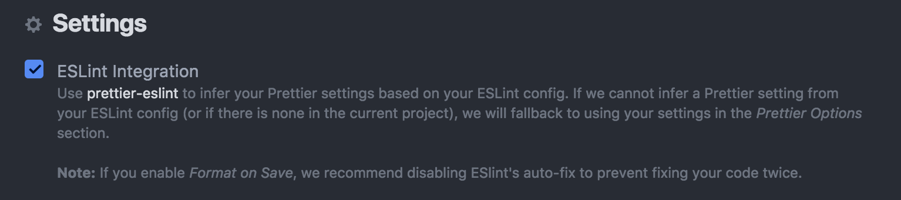

Different programmers have different styles of coding. One would put curly braces at the same line as function names, while others would write curly braces on a new line. Some tend to name variables in camelCase, others in PascalCase. There is no right or wrong. It’s only a matter of preference.

At GO-JEK, we always have at least two people for code pairing & reviewing a project. The moment two or more programmers put their hands on a project, you’ll start to notice inconsistency across your codes. This inconsistency bothers my engineering conscience.

*Obsessive Compulsive Disorder (OCD)*

*P.S. In this post I’m going to assume we are building a React app with [create-react-app](https://github.com/facebook/create-react-app), although most of the concepts here are applicable to any Javascript development.*

## ESLint to the rescue

Luckily we are not alone and that’s why [Nicholas C. Zakas](https://twitter.com/slicknet) built [ESLint](https://eslint.org/).
> Its goal is to provide a pluggable linting utility for JavaScript.

You can either install ESLint globally or vendor as project’s dependency (preferred). Let’s install it as a project’s development dependency:

```bash
npm install --save-dev eslint
```


Then you can run an interactive initialization command:

```bash
./node_modules/.bin/eslint — init
```


You’ll be asked to pick any base rules you wish to extend and config file format. In our case, we pick [airbnb-eslint-config](https://github.com/airbnb/javascript/tree/master/packages/eslint-config-airbnb) as base rules and JSON as config format. Voila! just like in Unix, a `runcom` fossil is generated as `.eslintrc` file in project’s root directory. Here’s how it looks,

```json
{
  "env": {
    "browser": true,
    "jest": true
  },
  "extends": ["airbnb"],
  "parser": "babel-eslint",
  "rules": {
    "class-methods-use-this": 0,
    "import/no-named-as-default": 0,
    "react/jsx-filename-extension": [
      "error",
      {
        "extensions": [".js", ".jsx"]
      }
    ]
  }
}

```

Let’s try to decipher `.eslintrc` relics,

1. **env** — By default, Airbnb config uses `[no-undef`](https://eslint.org/docs/rules/no-undef) rule. If you use browser globals like `localStorage` or `window` in your code, these rules will cause linter to complain that those variables being never defined. Setting “browser” env key to true essentially tells linter, “Hey chill, I’m pretty sure these localStorage and window variables are defined by the browser. Don’t worry about it.” You can refer [here for the list of supported env values.](https://eslint.org/docs/user-guide/configuring#specifying-environments)

1. **extends** — These are the base rules you wish to extend.

1. **parser** — This allows you to tune JavaScript transpiler and ES language features you like support. e.g. If you’re using ES6’s module system`import React from 'react'`, you might bump into `the keyword 'import' is reserved` error. This is because ESLint doesn’t know about ES6 features yet. To fix this, you need to install [babel-eslint](https://github.com/babel/babel-eslint) `npm i --save babel-eslint` and set it as the parser.

1. **rules** — I don’t really agree with all Airbnb’s base rules. If you feel the same way, you can override them here. For example, Airbnb base rule by default pick `react/jsx-filename-extension` rule and only allows JSX tag to appear in .jsx files. To us, it makes sense to have JSX tag in .js files, so we added .js to the allowed extension.

Once you have fine-tuned the rules as desired, you could run:

```bash
./node_modules/.bin/eslint --fix <your_directory>
```


TADAAA! Your code is all fixed now! Except… Maybe not. `--fix` turns out to only support few rules. As you can see from [this page](https://eslint.org/docs/rules/), there are not many wrench (fixable) icons.

*Name a more iconic duo. ESLint + Prettier. I’ll wait.*

## Make it Prettier

Prettier is a code formatter that works differently from `--fix` under the hood.
> Prettier takes your code and reprints it from scratch by taking the line length into account.

One example of **what Prettier can do that ESLint’s `**--fix`** can’t do is**:

```javascript
// bad
foo(reallyLongArg(), omgSoManyParameters(), IShouldRefactorThis(), isThereSeriouslyAnotherOne(), noWayYouGottaBeKiddingMe());
```


If you set `[max-le](https://eslint.org/docs/rules/max-len)n` rule to 80, ESLint will just give you a warning that it’s too wide. If you use Prettier, it will format your code into this:

```javascript
// good
foo(
  reallyLongArg(),
  omgSoManyParameters(),
  IShouldRefactorThis(),
  isThereSeriouslyAnotherOne(),
  noWayYouGottaBeKiddingMe()
);
```


Hopefully, you’re now convinced of using Prettier. It has few lint rules it supports on its own. But there are not many. Therefore, our goal is to now **have Prettier do the code formatting based on the ESLint rules we define**. Let’s start by installing these 3 libraries:

```bash
npm install --save-dev prettier eslint-plugin-prettier eslint-config-prettier
```


1. [**prettier](https://github.com/prettier/prettier)** — the core prettier library. *Duh*.

1. [**eslint-plugin-prettier](https://github.com/prettier/eslint-plugin-prettier)** — this plugin allows you to format code using Prettier when you run `--fix` . *Say whaaaat*.

1. [**eslint-config-prettier](https://github.com/prettier/eslint-config-prettier)** — what happens if my ESLint rule says I need a comma at the end of every line, but my Prettier rule says that should never happen? This library solves just that. It turns off conflicting rules. ESLint’s rules, not Prettier’s. *Obviously*.

All you have to add `plugin:prettier/recommended` to the “extends” key in `.eslintrc` as such:

```json
{
  "extends": ["airbnb", "plugin:prettier/recommended"],
}
```

[That addition does 3 things](https://github.com/prettier/eslint-plugin-prettier#recommended-configuration):

1. Enables `eslint-plugin-prettier`.

1. Sets the `prettier/prettier` rule to `"error"`.

1. Extends the `eslint-config-prettier` configuration.

Now run this command again:

```bash
./node_modules/.bin/eslint --fix <your_directory>
```


and you’ll have Prettier do the formatting for your ESLint rules 🚀

## Taking it further

Asking programmers to run a command on every edit is not the most efficient way to enforce consistency. Here ate 3 alternatives you can follow to automate this:

**1. Format on save with your favourite editor**

Prettier has [support for most popular editors such as Atom, VSCode, Sublime, WebStorm, and even Vim](https://prettier.io/docs/en/editors.html). You just need to get them installed, enable “format on save”, and enable ESLint integration.



*But that’s super manual and time consuming to get it working with an existing dev setup.*

**2. Add lint stage in project’s CI/CD**

You can add a script in your `package.json` as follows:

```json
{
  "scripts": {
    "lint": "eslint src"
  }
}
```


Note: we don’t need `./node_modules/.bin` when running using npm script because it will default to the project library, not the globally installed `eslint` (if any). Then in your CI config, add a lint stage:

```yaml
stages:
  - test

# test stage - test job
test:
  stage: test
  script:
    - npm test -- --coverage

# test stage - lint job
lint:
  stage: test
  script:
    - npm run lint
```

This will cause project’s pipeline to fail, if the committed code does not pass lint rules.

*Aha! now CI can report linting issues. No more, it works on my machine.*

**3. Pre-commit hook**

You can use Prettier with a pre-commit tool. This can re-format your files that are marked as “staged” via `git add`before you commit. Prettier has the full list of options to achieve that; we are going with `[lint-staged`](https://github.com/okonet/lint-staged) and `[husky`](https://github.com/typicode/husky)

```bash
npm install --save-dev lint-staged husky
```


Then add these scripts into `package.json`

```json
{
  "scripts": {
    "precommit": "lint-staged"
  },
  "lint-staged": {
    "src/**/*.{js,jsx,json,css,md}": ["eslint --fix src", "git add"]
  }
}
```


Now your lint `--fix` will be run every time you execute `git commit` and you can be assured that your codebase is consistent and well-formatted. *That’s more like it.*
> don’t let 💩 slip into your codebase. — [lint-staged](https://github.com/okonet/lint-staged)

## **Final words**

Linting can be one aspect people overlook in a codebase because more often than not, a project starts with a single person. Adding linter not only increases consistency, but helps detect bugs early and build maintainable code. The earlier we adopt, the better.
> # “Always code as if the guy who ends up maintaining your code will be a violent psychopath who knows where you live” ― **John Woods**

Any recommendations, tips? Would love to hear more.

If you’re interested in building beautiful, consistent, maintainable codebases, we are hiring Software Engineers! Check out [gojek.jobs](http://gojek.jobs) for more information.

--

Originally posted at: https://medium.com/gojekengineering/eslint-prettier-for-a-consistent-react-codebase-eaa673debb1d