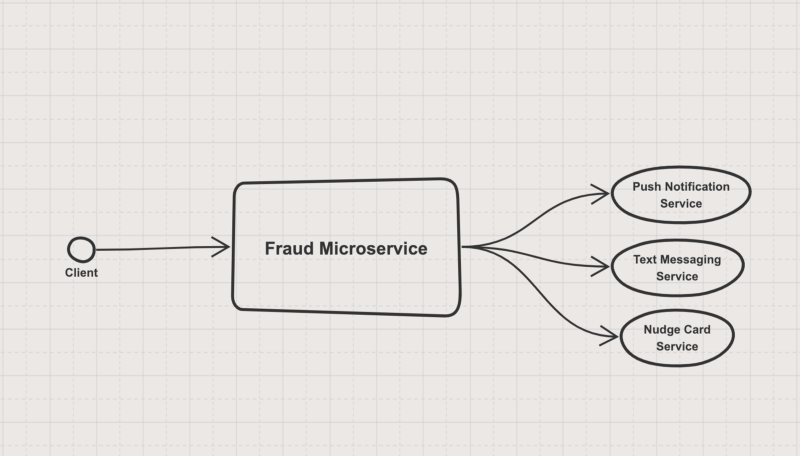

If you’re new to Golang, you may not have heard of the ‘golden file’. I found out about it after two years of coding in Go, when I stumbled upon Mitchell Hashimoto’s talk about [Advanced Testing in Go](https://www.youtube.com/watch?v=8hQG7QlcLBk). There was no official documentation around it, not many blogs mention it, and nobody knows why it’s called golden file. All we know is that the standard package has it: [gofmt/testdata.](https://github.com/golang/go/tree/master/src/cmd/gofmt/testdata)

This post explains how the golden file is a useful alternative to traditional table tests in Golang for specific scenarios.

### What is the Golden File?

Conceptually, it’s nothing new. If you come from a Javascript background and have used Jest testing library before, this is basically what Jest calls [snapshot testing](https://jestjs.io/docs/en/snapshot-testing). It saves the output of a test to a file and uses it as the expected output.

> That’s a testing hack, why would someone do that?

This is best explained using a real use case I experienced in the Fraud team at GOJEK as an example. Imagine the simplified diagram of a microservice we are building below:



The microservice acts like a proxy service that accepts an HTTP request, does some business logic, and triggers API calls to another microservice. More specifically, it is intended to send communication messages to the appropriate API based on the request received, i.e. push notification, SMS, or in-app nudge card. To ensure everything works as expected, we wrote a table-driven test:

Few commits later, this is what our table test looked like:

There are three observations I want to highlight here:

1.  First of all, the table test is superb. The time spent to implement a template and loop that iterates through the table is worth the overhead cost of adding various test scenarios. I highly recommend using this pattern.
2.  As our test cases and the number of assertions grew, our table became too cluttered. It became harder for developers to understand and modify the test cases.
3.  One of the assertions we want to do is to ensure that we send the correct HTTP header and body to the other microservice. This is the part that primarily bloats our table to a non-human-friendly situation 🤖

### Here is our golden opportunity

Fortunately for us, we have the golden file. This method is most useful when one wants to assert a huge chunk of bytes — such as image base 64 string, JSON file, or (in our case) HTTP body. Instead of writing the expected JSON body in the test file, we can save it to`testdata/TestAPI_Comms_Success.golden`. Next, we can manually create the golden file, though a better way is to use an `update` flag. This is to let the test know if we intend to update the golden file or assert the test output against the golden file. Let’s modify our assertion:

If you haven’t figured out yet, the additional code in TestAPI\_Comms\_Success function essentially dumps the `logs` table into `TestAPI_Comms_Success/<test-case-name>.golden` in a beautified JSON format. So, there are now two modes to run the test:

1.  **Update**

```bash
go test ./... -update
```

When the update flag is passed, whatever the logs table contains will be saved into the golden file. For example:

```json
[{  
  "id": 1,  
  "entity_id": 1,   
  "entity_type": "driver",   
  "action": "comm1",   
  "api_name": "service-A",   
  "http_method": "POST",  
  "http_body": {  
    "type": "comm-service",   
    "action": "send-notification",   
    "priority": "medium",   
    "when": "now"  
  },  
  "http_response_status_code": 200  
}]
```

**2\. Assert**

```bash
go test ./...
```

Without the update flag, the code will run the query that retrieves logs from database. It then compares it against what was written into the golden file earlier.

#### What’s the catch?

In golden file testing, the most crucial step is manually eyeballing the golden file to ensure the output saved matches our expectation. That’s why we printed out the JSON in beautified format, so that this task becomes easier.

### More advanced scenarios

If the above setup is sufficient for your golden file testing, that’s great. Unfortunately for us, there are three issues that needed to be tackled:

#### 1\. Asynchronous architecture

Our microservice uses an asynchronous architecture where there are message queues (RabbitMQ) and workers that pick up the jobs. In this case, when we want to generate the golden file, we don’t know exactly when to read the logs from database. The log could be written by the worker 50ms later, 100ms later, or 300ms later.

The solution is adding a `time.Sleep()` with the amount of time by when you’re confident the worker will finish the job. Alternatively, you can use [Gomega’s Eventually](https://onsi.github.io/gomega/#eventually). It can poll your asynchronous assertion at your desired frequency and timeout.

#### 2\. Time/UUID field

Our logs table contains fields such as `log_id, created_at, updated_at,`which always change whenever golden file is generated. One way to solve this is by excluding these fields when querying the database for the golden file. If you have many tables to be asserted in golden file (like we did), [monkeypatch](https://github.com/bouk/monkey) is a decent solution.

```go
// Patch time.Now() to static time so that we can compare golden files correctly  
timezone, err := time.LoadLocation("Asia/Jakarta")  
timeNowPatch := monkey.Patch(time.Now, func() time.Time {  
  return time.Date(2012, time.December, 5, 15, 0, 0, 0, timezone)  
})
```

The only catch here is when you write the log into the database, you must pass `time.Now()` as argument to `created_at` field, instead of using your Postgres function `now()`.

Now for UUID, we use [https://github.com/google/uuid](https://github.com/google/uuid). What we can do is to feed a static random number reader, so that the generated UUIDs are always the same:

reader := bytes.NewReader(\[\]byte("1111111111111111"))  
uuid.SetRand(reader)  
uuid.SetClockSequence(1)

#### 3\. A Better Golden File Diff

Writing an output such as `There is a mismatch in TestAPI_Comms_Success.golden` is not helpful information when your golden file is 200 lines long. One must eyeball field by field and compare which one is different. To make our life easier, we use [gomega.MatchJSON](https://onsi.github.io/gomega/#matchjsonjson-interface) which highlights which JSON key has a mismatch.

### Is the golden file for me?

This method is not for everyone. If all test cases fit just fine in a table test, there is no need to write golden file. In such scenarios, the benefits are not worth the time spent and possibility of human error while analysing golden file changes. However, when used for the right use cases, the golden file makes life much better.

GOJEK runs one of the largest Go clusters in Asia. We’ve scaled over 6600x since we launched our app in 2015, and expanded to Vietnam, Singapore and Thailand in 2018. We’re still growing, and always learning. Head over to [gojek.jobs](http://bit.ly/2Iw18eu), and be a part of our journey to redefine transport, payments and logistics in Southeast Asia 🙌

[](http://bit.ly/2Iw18eu)

--

Originally posted at: https://medium.com/gojekengineering/the-untold-story-of-golang-testing-29832bfe0e19